**- WMS -**

**仓储管理系统**

**操作手册 -- 退货换标篇**

+-------------+-------------+-------------+-------------+
| #           | **人 员**   | **时 间**   | **备 注**   |
+:===========:+:===========:+:===========:+=============+
| 编写        | Ankry       | 11/25/2025  | #           |
+-------------+-------------+-------------+-------------+
| 审核        |             |             | #           |
+-------------+-------------+-------------+-------------+

\- WMS 退货换标流程图 -

{width="7.268055555555556in"
height="7.14375in"}

# 目录

[目录 [3](#_Toc214981372)](#_Toc214981372)

[- PDA操作 - [4](#pda操作--)](#pda操作--)

[一、 退货计费方案设置 [5](#退货计费方案设置)](#退货计费方案设置)

> [a. 设置退货费用 [7](#设置退货费用)](#设置退货费用)
>
> [b. 设置退货换标费用 [9](#设置退货换标费用)](#设置退货换标费用)

[二、 创建/导入SKU [12](#创建导入sku)](#创建导入sku)

[三、退货 [15](#三退货)](#三退货)

> [3.1　退货入库 [15](#退货入库)](#退货入库)
>
> [3.2　退货管理 [16](#退货管理)](#退货管理)
>
> [3.2.1 修改退货SKU数量 [18](#修改退货sku数量)](#修改退货sku数量)
>
> [3.2.2 继续上架 [19](#继续上架)](#继续上架)
>
> [3.2.3 异常退货补录SKU信息
> [21](#异常退货补录sku信息)](#异常退货补录sku信息)

[第4章 换标 [22](#第4章-换标)](#第4章-换标)

> [4.1　换标 [22](#_Toc214981385)](#_Toc214981385)

# - PDA操作 -

**步骤1.** 使用**手持PDA**登录浏览器，输入仓库管理系统网址

- 网址： 网站域名 + 后缀 **/pda** ( 如：www.testwms/pda )
  {width="2.593426290463692in"
  height="0.39578412073490815in"}

> {width="2.138260061242345in"
> height="2.615516185476815in"}

**步骤2.**
在PDA上使在用**仓库经理**账号密码登录（管理员账户不可登录PDA端）

> {width="2.417424540682415in"
> height="2.438203193350831in"}

# 退货计费方案设置

当用户有退货需求，**管理员**需要提前为该用户设置退货换标计费方案，系统将根据设置的计费方案自动收取客户的退货费用。

- 入口：登录系统 -\>\> 仓库管理-\>\> 报表-\>\> 计费方案设置

1.  **管理员角色**登录系统，进入-\>\> **计费方案设置** 界面。

> 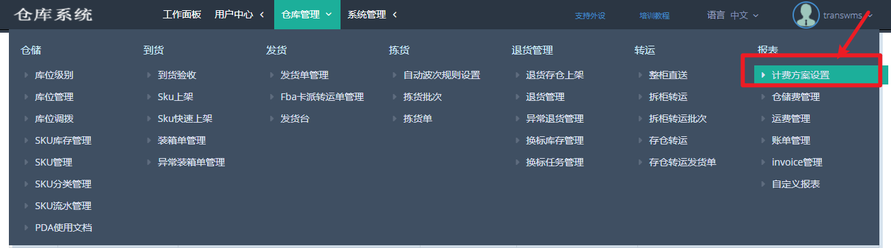{width="7.268055555555556in"
> height="2.0305555555555554in"}

2.  设置了多个计费方案，选将用户放置在哪个计费方案，就选择计费方案，点击
    ---\>\> **用户**

{width="7.268055555555556in"
height="4.083333333333333in"}

3.  点击选择该用户名，再点击-\>\>**新增用户**

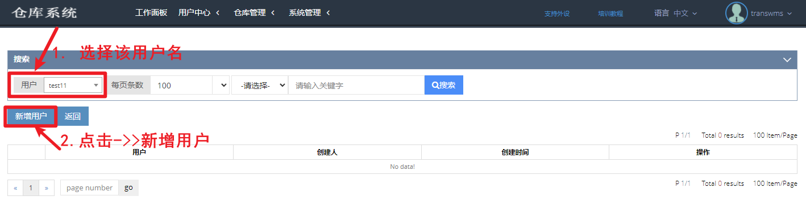{width="7.268055555555556in"
height="1.9631944444444445in"}

4.  设置好后，点击-\>\>**返回**

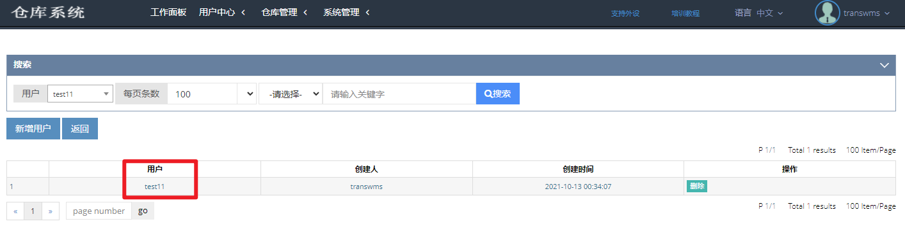{width="7.268055555555556in"
height="1.88125in"}

5.  该计费方案添加了用户后，需要设置该计费方案的退货换标计费规则，点击-\>\>**费用组**

{width="7.268055555555556in"
height="3.158333333333333in"}

### 设置退货费用

1.  进入费用组，选择-\>\>**设置退货费用** ，再点击-\>\> **新增退货费用**

{width="7.268055555555556in"
height="2.109027777777778in"}

2\. 退货的费用类型可以根据以下规则设置，设置好后系统将自动按规则收取：

  -----------------------------------------------------------------------------------------------
  费用类型          类型说明
  ----------------- -----------------------------------------------------------------------------
  **每个包裹**      根据每一个包裹（每一个跟踪单号）

  **每个板**        若设置了库位为"板"库位，入库后，则会根据板来加收费用

  **每个SKU**       根据退货的每一个SKU来收取费用

  **每张照片**      用PDA扫描退货时可以给客户拍照

  **创建临时SKU**   客户没有提前创建sku，仓库经理扫描入库时为客户补录sku的尺寸/重量所收取的费用
  -----------------------------------------------------------------------------------------------

> {width="6.861134076990377in"
> height="3.4148326771653545in"}
>
> 退货还可以根据FBA退货和非FBA退货来设置不同的收费规则
>
> {width="7.268055555555556in"
> height="3.15625in"}
>
> **注意：不同的费用类型可以叠加收费**

例如下图，每个包裹和每个SKU都设置了收费规则，退货包裹扫描入库时，会先收取每个包裹的费用，再收取每个SKU的费用，会叠加收费。

> {width="7.268055555555556in"
> height="2.8444444444444446in"}

### 设置退货换标费用

当有用户需要退货换标服务，**管理员**需要提前为该用户设置退货换标计费方案，以便于后续换标产生的费用能被正常扣除。

**步骤1：**
进入费用组，选择-\>\>**设置退货换标费用**，再点击-\>\>**新增换标费**

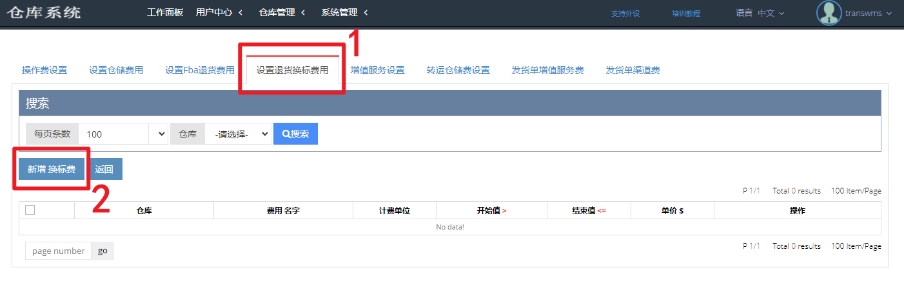{width="7.268055555555556in"
height="2.395138888888889in"}

**步骤2：**
新增换标费用，是根据重量区分包裹计费价格，按件收取。例如，我们设置小包裹0-10lb之间的包裹，每件换标费用为\$1。若换10件5lb重的包裹的标，则系统自动收取\$10。

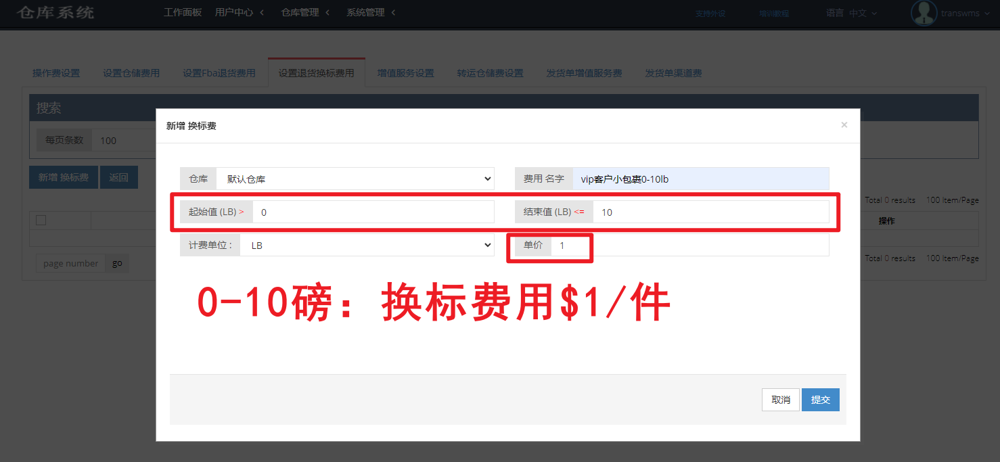{width="5.550127952755905in"
height="2.564534120734908in"}

**步骤3：**
同理，可以设置中包裹、大包裹计费方案，尽量覆盖到所有重量区间的包裹。

> {width="6.560601487314086in"
> height="1.5677504374453193in"}

{width="6.6113888888888885in"
height="1.5918875765529308in"}

这样就可以完全覆盖所有重量区间，该用户的退货换标计费方案设置完成。

{width="7.268055555555556in"
height="2.4472222222222224in"}

# 创建/导入SKU

- 用户有退货需要换标，管理员需要指导用户提前在WMS系统上录入SKU信息，以便于计算库存费用与保存记录。若用户不方便导入，管理员也可以在系统给客户导入SKU信息。

<!-- -->

- 入口：**用户中心 -\>\> 产品 -\>\> SKU信息**

**步骤1.** 用户使用账号密码登录系统，进入-\>\> **SKU信息**

{width="7.268055555555556in"
height="2.15in"}

**步骤2.** 新增SKU有两种方法，根据需求选择

> （1）**添加SKU**：添加单个SKU
>
> （2）**导入SKU**：批量添加SKU
>
> {width="5.768055555555556in"
> height="2.154861111111111in"}
>
> **（1）添加SKU**

选择产品分类，上传产品图片，填写 SKU编号、体积、重量等信息，保存点击
-\>\> **确定**

> {width="5.516882108486439in"
> height="3.8716469816272965in"}
>
> **（2）导入SKU**

1\. 点击 -\>\> **下载模板**

> 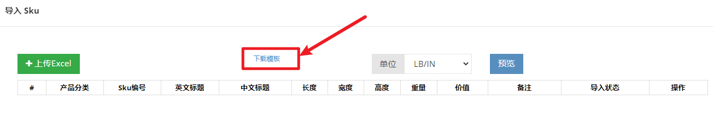{width="5.768055555555556in"
> height="1.0569444444444445in"}

\-

2\. 按照模板格式填写SKU产品信息，保存excel表格

> {width="5.768055555555556in"
> height="0.9513888888888888in"}

3\. 点击 -\>\> **上传excel** , 再点击 -\>\> **预览**

{width="5.768055555555556in"
height="1.2222222222222223in"}

4\. 确认无误，则点击-\>\>**确认**

（ 若提示出错，则按照提示要求修改excel表，重新上传预览即可）
{width="5.345917541557306in"
height="3.151813210848644in"}

5\. 此时，可以在列表中看到已创建的SKU。

> {width="7.268055555555556in"
> height="3.5520833333333335in"}

# 三、退货

仓库经理收到用户需要换标的退货后，需要对退货进行上架（入库）操作。

## 3.1　退货入库

- **入口：仓库管理员角色使用手持PDA登录系统**

**步骤1**：使用**手持PDA**登录浏览器，输入网址：[**wms2.hygj52.com/Pda/Login**]{.underline}

**步骤2：**PDA上使在用[仓库经理账号]{.underline}密码登录

**步骤3：**进入系统后，点击顶部菜单栏选择 -\>\> 仓库管理 -\>\>
**退货入库**

**步骤4：**扫描箱子编号 -\> 扫描SKU编号 -\> 填写数量 -\> 扫描库位 -\>
揽收上架。当系统提示"success"，则表示该SKU入库上架成功。

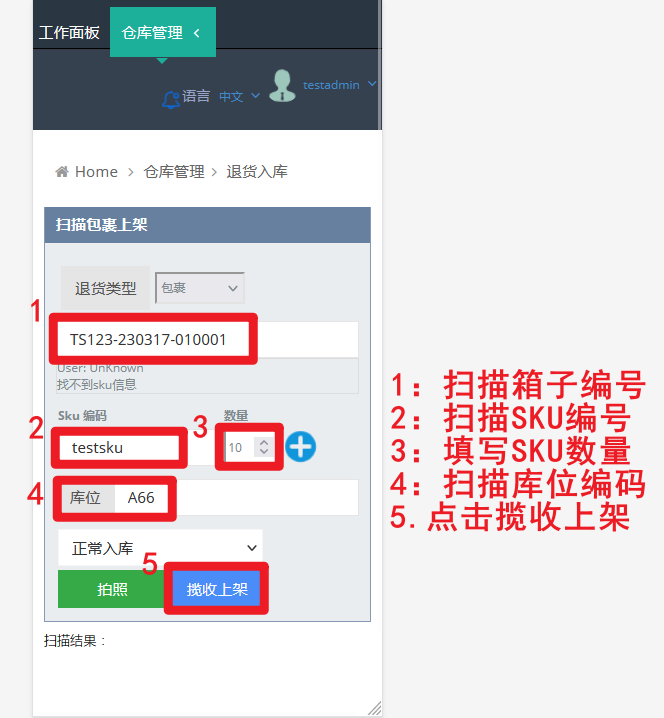{width="4.876227034120735in"
height="4.3894258530183725in"}

- 仓库管理员也可以点击-\>\>
  拍照，使用PDA拍下退件的图片并上传，用户可以在退货管理中查看该图片。

- 当系统显示SKU不存在，系统将自动归为异常退货，需要后期补充SKU信息。

## 3.2　退货管理

- **入口：仓库管理 -\>\> 退货管理 -\>\> 退货管理**

使用PDA进行退货上架成功后，在退货管理处可以查看退货记录。退货将会出现以下三种情况：1.成功入库，2.需补充SKU，3.待认领。举例如下所示：

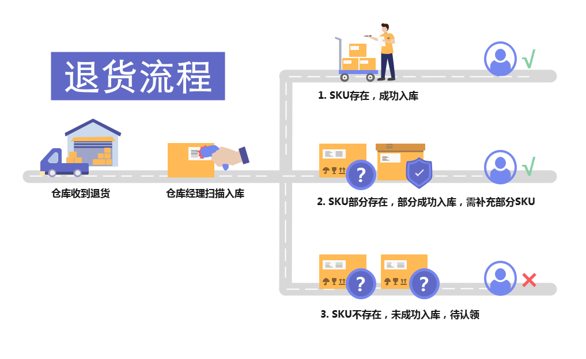{width="7.25625in"
height="4.463888888888889in"}

  -----------------------------------------------------------------------------------------------------------------------------
  退货状态            图标                                                           表示
  ------------------- -------------------------------------------------------------- ------------------------------------------
  Arrial              {width="0.6040912073490814in"   SKU存在，成功入库
                      height="0.26038385826771654in"}                                

  Need supplement sku {width="1.6352121609798775in"   SKU部分存在，部分成功入库，需补充部分SKU
                      height="0.2395538057742782in"}                                 

  Wait claim          {width="0.8332294400699912in"   SKU不存在,未成功入库,待认领
                      height="0.2395538057742782in"}                                 
  -----------------------------------------------------------------------------------------------------------------------------

**情况1.**
若退货的Sku都存在，则入库成功。该退货SKU状态为"Arrival"。如下图所示：

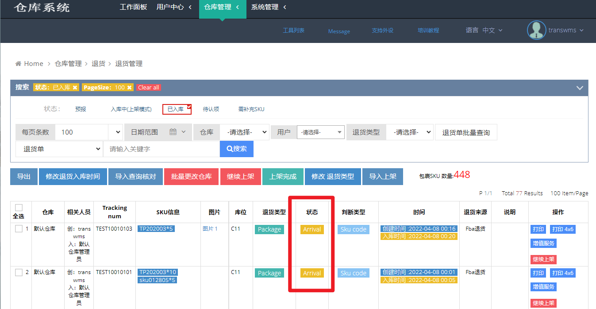{width="6.984607392825897in"
height="3.7678477690288714in"}

> **情况2.**
> 若该退货的Sku部分存在（即系统可以根据存在的Sku识别到相应用户），但部分SKU没有录入到系统，**需要补充SKU信息**，此类退货由于缺少SKU信息，并未成功入库，则被标记为异常退货，状态为"Need
> supplement sku"如下图所示：
>
> 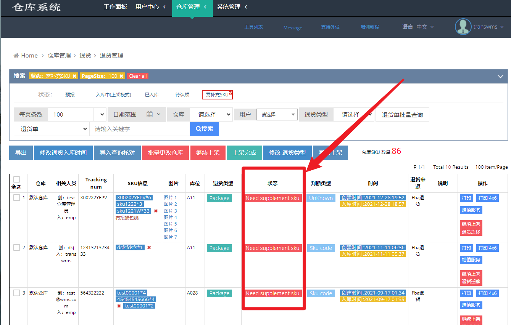{width="6.98452646544182in"
> height="3.7582163167104112in"}
>
> **情况3.**
> 若该退货的Sku都不存在，则该退货无法识别属于哪个用户，无法对退回的SKU作入库操作，该退货为"Wait
> claim"状态。如下图所示：

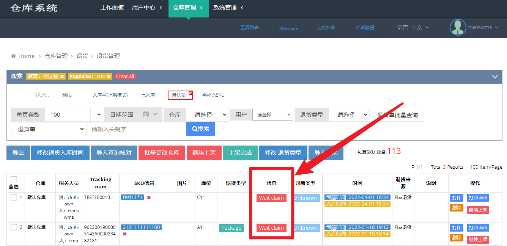{width="7.203873578302712in"
height="3.044255249343832in"}

### 3.2.1 修改退货SKU数量

当退货入库的SKU数量申报有误，需要修改。

- 若当**[SKU不存在]{.underline}**系统，可以点击标有"x"的SKU（交叉"x"表示不存在系统）

> 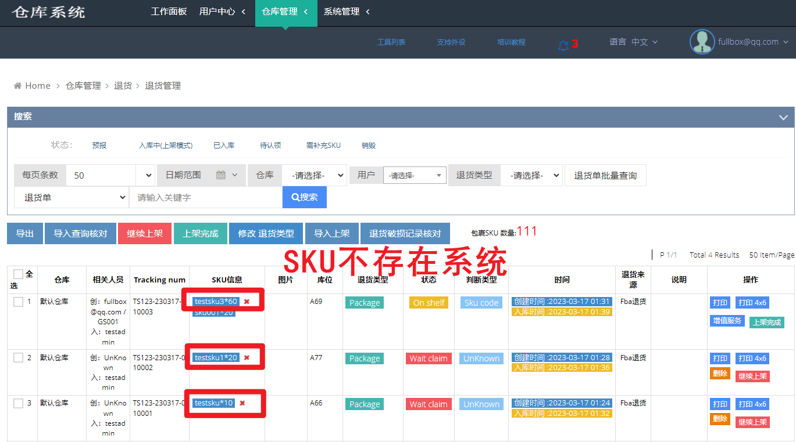{width="6.875685695538058in"
> height="3.826759623797025in"}
>
> 填写更改后的数量-\>\>**提交**，即可对不存在系统的SKU数量进行修改。
>
> 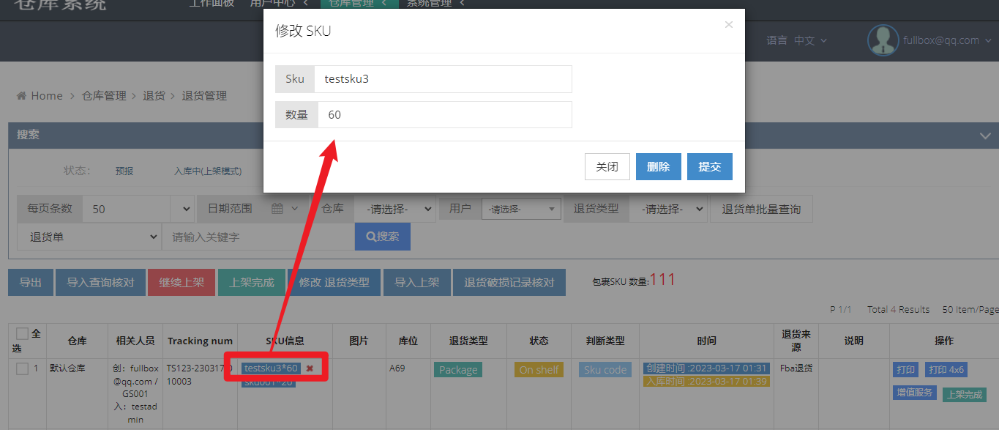{width="6.883498468941382in"
> height="2.9596533245844268in"}

- 若当**[SKU存在]{.underline}**系统，则进入SKU库存管理，进行调整库存操作。

> 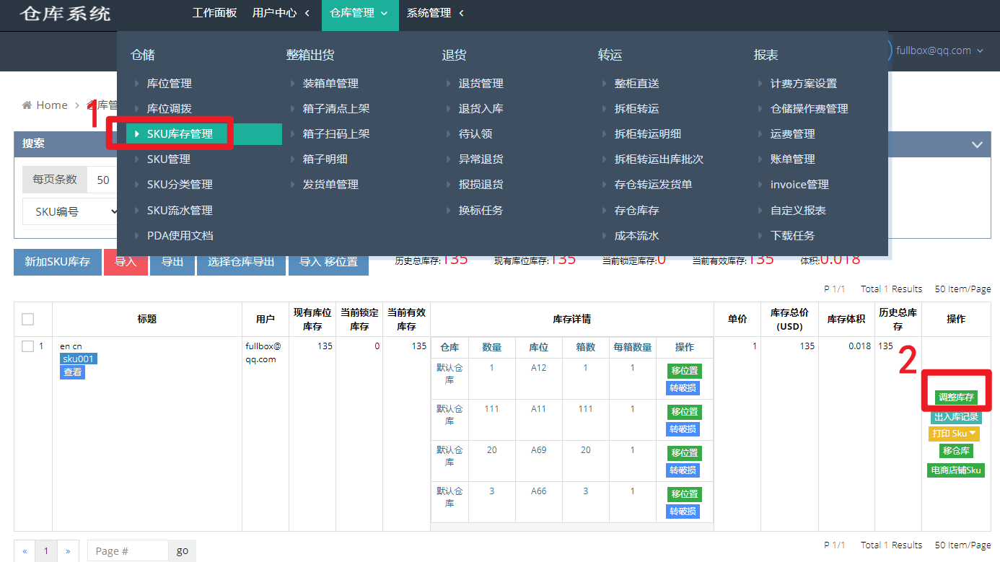{width="6.920249343832021in"
> height="3.889251968503937in"}

### 3.2.2 继续上架

当此装箱由于外力因素导致扫描中断，需要重新上架时。仓库管理员重新进入PDA端的-\>\>
**退货入库** 界面，扫描箱子编号，点击-\>\> **OK** 继续上架。

> 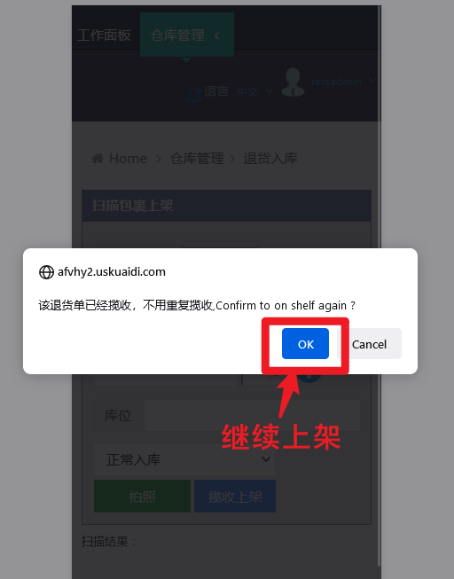{width="4.028976377952756in"
> height="4.193692038495188in"}

### 3.2.3 异常退货补录SKU信息

异常退货，即**3.2退货管理**中的情况2和情况3，即该退货的Sku部分存在或全部不存在，无法成功入库的退货，需要管理员补录SKU信息，当补充了SKU信息后，**系统才会自动扣除退货费并开始计算仓储费**。

- 入口：仓库管理 -\>\> 退货管理 -\>\> 异常退货

> 管理员根据异常退货的sku情况，到-\>\> **SKU管理** 中，进行补充SKU。

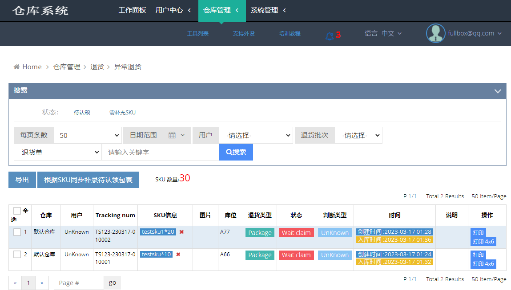{width="6.917356736657918in"
height="3.9371959755030623in"}

# 第4章 换标

仓库经理角色对用户生成的退货换标任务申请，进行换标操作。

**步骤1：仓库经理角色**登录系统，进入 -\>\> **换标任务**

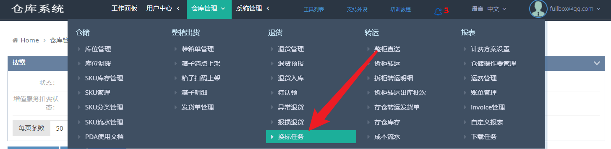{width="6.7651891951006125in"
height="1.6631791338582678in"}

**步骤2：**在列表中可以查看到用户申请的退货换标任务

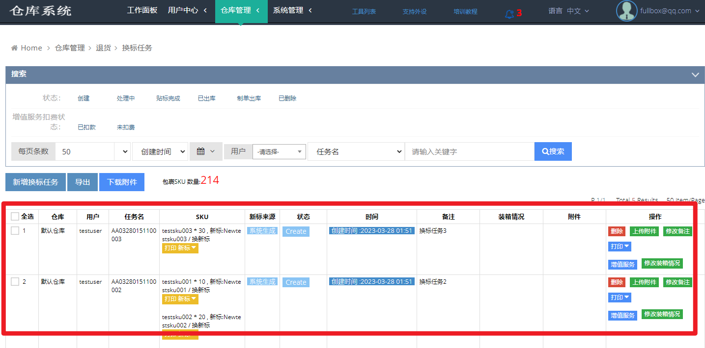{width="6.773543307086614in"
height="3.351175634295713in"}

**步骤3：**点击打印拣货单-\>\>**打印4X6**
，此时该换标任务状态由"**创建**"更新为"**处理中**"

再点击下载SKU新标

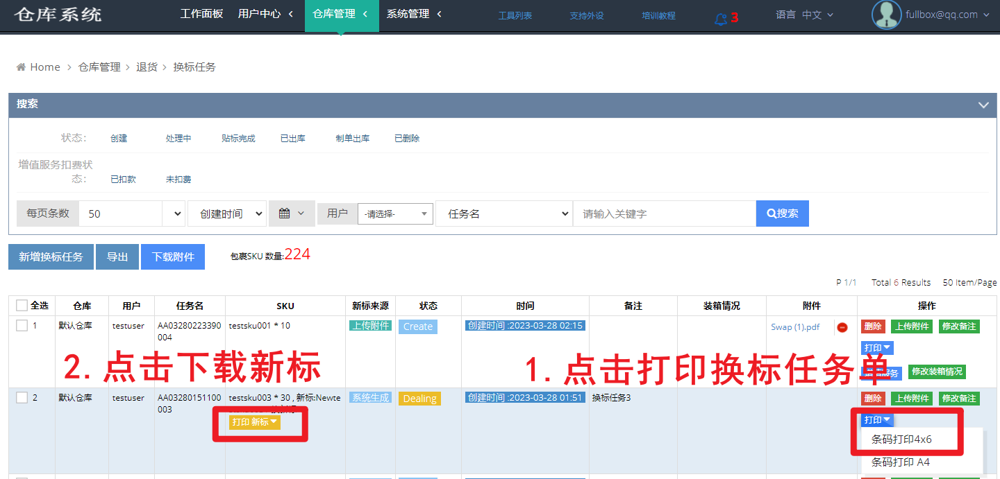{width="6.923464566929134in"
height="3.3221522309711284in"}

若为用户自行上传的附件，需要在附件列表处点击下载

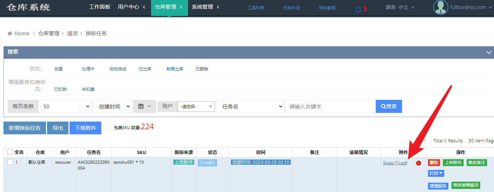{width="6.892507655293088in"
height="2.6816633858267718in"}

**步骤4：**如仓库处理完成换标后，需点击 -\>\> **贴标完成**

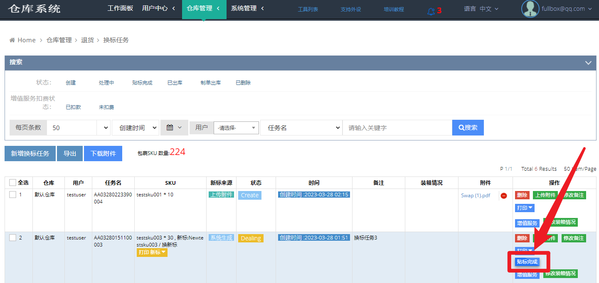{width="6.758672353455818in"
height="3.1550699912510938in"}

> **步骤5：**填写贴标情况，箱数，SKU件数，箱规等信息，确认无误后，点击-\>\>
> **确定**。

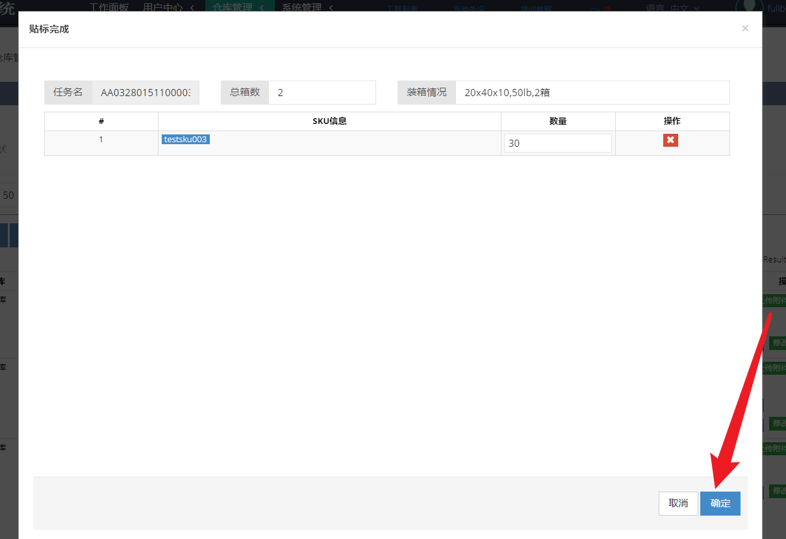{width="6.794327427821522in"
height="4.660470253718286in"}
